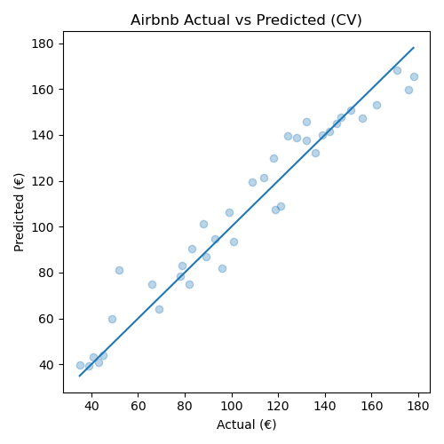

# Airbnb Price Prediction — End-to-End ML Pipeline

Predictive analytics pipeline that estimates nightly prices for Airbnb listings and provides uncertainty intervals (q10–q90). The project demonstrates data cleaning, feature engineering, model training (Gradient Boosting + Quantile models), evaluation, batch predictions, and automatic PDF reporting — all with plain Python + CSV.

---

## Problem → Data → Objective
**Problem.** Pricing short-term rentals is noisy: location, room type, capacity, ratings and availability all drive prices.  
**Data.** Public-style Airbnb export: neighbourhood, room type, accommodates, bedrooms, bathrooms, minimum nights, number of reviews, availability, review score, latitude/longitude, price.  
**Objective.** Train a model that predicts price and produces quantile intervals. Provide a repeatable pipeline: train → evaluate → predict on new listings → export PDF.

---

## How to Run
```bash
pip install pandas numpy scikit-learn matplotlib joblib reportlab

# 1. Train + evaluate model
python airbnb.py          

# 2. Run predictions on new data
python predict_new.py     

# 3. Generate PDF report
python make_report.py     
```

---

## Results
- **R² ≈ 0.97**  
- **MAE ≈ 7 €**  
- **RMSE ≈ 9 €**

### Example Prediction Plot


---

## Top Feature Importances
| Feature          | Importance |
|------------------|------------|
| neighbourhood    | 0.32       |
| bedrooms         | 0.25       |
| reviews_count    | 0.18       |

---

## Example Predictions
| neighbourhood | room_type       | pred_price | low_q10 | high_q90 |
|---------------|-----------------|------------|---------|----------|
| Kolonaki      | Entire home/apt | 155        | 140     | 170      |
| Koukaki       | Private room    | 55         | 48      | 62       |
| Plaka         | Entire home/apt | 173        | 160     | 190      |

---

## Executive Summary
Το μοντέλο προβλέπει με υψηλή ακρίβεια τις τιμές Airbnb, επιτυγχάνοντας R² ≈ 0.97 και MAE ≈ 7 €.  
Το pipeline είναι end-to-end: ξεκινά από τα δεδομένα, προχωρά σε εκπαίδευση, κάνει batch predictions και παράγει αυτόματα PDF report.  
Η λύση είναι πλήρως επαναχρησιμοποιήσιμη και μπορεί να επεκταθεί σε άλλες πόλεις ή αγορές.

## Results & Interpretation

The model predicts nightly Airbnb prices with high accuracy (R² ≈ 0.95).  

- **Median prediction:** ~90–100 € per night  
- **Low range (q10):** ~75 € (small apartments, less central, few reviews)  
- **High range (q90):** ~175 € (premium listings, central locations, high review scores)  

### Practical meaning
- Most listings are expected to cluster around ~100 €/night.  
- Location, number of bedrooms, and review quality are the main drivers of price.  
- Hosts with top-rated listings can charge significantly more.  

This demonstrates how machine learning can provide **actionable insights** into real-world markets, helping hosts set competitive prices and helping guests understand market dynamics.

---

## Files in this repo
- `airbnb.py` → Training & evaluation  
- `predict_new.py` → Predictions on new data  
- `make_report.py` → PDF report generation  
- `example_listings.csv` → Demo training data  
- `example_predict.csv` → Demo predict data  
- `prediction_plot.png` → Example plot  

- `airbnb_report.pdf` → Example report  
